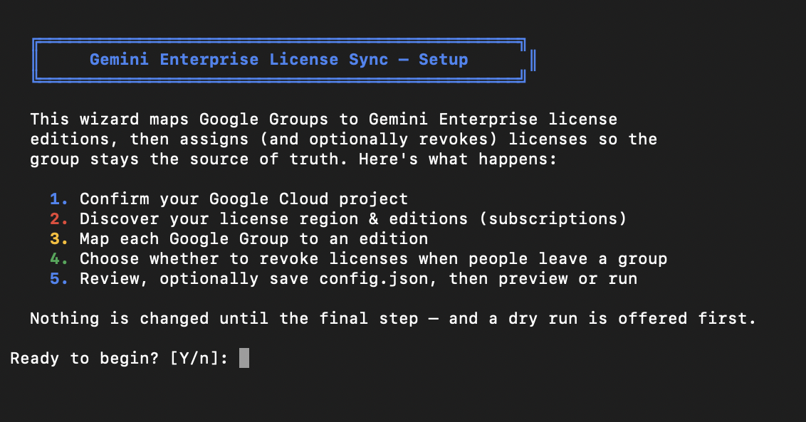

# Gemini Enterprise License Assignment Script



## The Problem

Gemini Enterprise does not support group-based license assignment natively currently. The console and API require individual email addresses, and the auto-assign feature only works for a single edition — it can't differentiate between Frontline, Standard, and Plus users.
If you're managing multiple editions across different user populations, you're stuck manually assigning licenses one by one.

## The Solution

Programmatically assign Gemini Enterprise licenses by edition using Google Group membership as the source of truth.

This script bridges Google Groups and the Gemini Enterprise Discovery Engine API. Define a mapping of Google Group → subscription edition, and the script will:

1. Pull members from each group via `gcloud identity`
2. Assign the correct license edition to each member via `batchUpdateUserLicenses`
3. Optionally remove licenses from users no longer in the group

This gives you group-based license management where the group is the single source of truth for each edition tier.

## How It Works

```
┌───────────────────────────┐
│   Google Groups           │
│                           │
│  gemini-plus@company.com  │──► Plus licenses
│  gemini-std@company.com   │──► Standard licenses
│  gemini-fl@company.com    │──► Frontline licenses
└───────────────────────────┘
            │
            ▼
    gcloud identity groups
    memberships list
            │
            ▼
┌───────────────────────────┐
│  batchUpdateUserLicenses  │
│  (Discovery Engine API)   │
│                           │
│  Each user gets the       │
│  licenseConfig matching   │
│  their group's edition    │
└───────────────────────────┘
```

### Required APIs & Permissions

Before running the scripts, ensure the following APIs and permissions are configured for your Google Cloud Project.

#### 1. Enabled APIs

You must enable the following APIs in your Google Cloud Project:
* **Cloud Identity API** (`cloudidentity.googleapis.com`) – Required to query Google Groups memberships.
* **Discovery Engine API** (`discoveryengine.googleapis.com`) – Required to retrieve license configurations and assign licenses to users.

#### 2. IAM Roles

To run these scripts, the authenticated user (or service account) must have the following permissions:

**A. Cloud Identity / Workspace Admin Roles**
Required to list the members of Google Groups (`gcloud identity groups memberships list`).
* **Google Workspace Admin** with Groups Reader privileges, OR
* **Groups Admin** role, OR
* **Groups Reader** role in Cloud Identity

**B. Google Cloud IAM Roles**
Required to query and assign licenses via the Discovery Engine API.
* **Discovery Engine Admin** (`roles/discoveryengine.admin`) on the target project, OR
* **Discovery Engine Editor** (`roles/discoveryengine.editor`)

## Quick Start (guided setup)

The fastest way to get going is the interactive wizard. Run the script with no
config and it walks you through everything — project, editions, group mappings,
revocation policy — then offers a dry run before touching anything:

```bash
./gemini-license-sync.sh --setup
```

The wizard auto-detects your project, lists your license editions, shows the
member count for each group you enter, writes `config.json` for you, and lets you
preview with a dry run. If you run `./gemini-license-sync.sh` with no `config.json`
in a terminal, the wizard launches automatically.

For cron/non-interactive use, pass `--no-input` so a missing `config.json` fails
fast instead of prompting.

## Manual Setup (Cloud Shell)

If you'd rather write the config by hand: the script auto-discovers your project
ID and project number in Cloud Shell, so you only need to define your group
mappings.

```bash
# 1. Verify your environment is ready
./gemini-helpers.sh check-prereqs

# 2. Copy the config template
cp config.json.example config.json
```

### 3. Edit your Configuration

You can easily edit `config.json` using the built-in Cloud Shell Editor. Simply click the **Open Editor** button at the top of your Cloud Shell window, navigate to `config.json`, and define your group mappings:

```json
{
  "project_id": "",
  "project_number": "",
  "location": "global",
  "endpoint_location": "global",
  "delete_unassigned": false,
  "batch_size": 100,
  "group_mappings": {
    "marketing-team@example.com": "YOUR_SUBSCRIPTION_ID"
  }
}
```

> **Note:** Leave `project_id` and `project_number` as empty strings `""` and the script will automatically discover them from your Cloud Shell environment.

> **Tip:** If your project has a **single** license config, you can set the subscription value to `"auto"` and the script will resolve it at startup — so the only thing you configure is the group email:
> ```json
> { "group_mappings": { "your-group@example.com": "auto" } }
> ```
> With multiple editions, `"auto"` is ambiguous; the script lists the available configs and exits so you can set explicit IDs.

### 4. Find Your Subscription IDs

If you don't know your subscription IDs, you can list them via:

```bash
./gemini-helpers.sh list-configs
```

### 5. Preview with Dry Run

Before making any changes, preview what the script would do:

```bash
./gemini-license-sync.sh --dry-run
```

This fetches group members and logs all actions without making any API calls to assign licenses.

### 6. Run the Sync

```bash
./gemini-license-sync.sh
```

The script logs all operations to a timestamped log file (`gemini-license-sync-YYYYMMDD-HHMMSS.log`).

## Local Execution (Optional)

If you prefer to run this script locally on your own terminal instead of Cloud Shell, you will need to manually set `project_id` and `project_number` in `config.json`.

You can find your numeric project number by running:

```bash
./gemini-helpers.sh get-project-number my-gcp-project
```

## Run on Cloud Run Jobs

For unattended, scheduled syncs, run the script as a **Cloud Run job**. The
repository ships a `Dockerfile` (Debian slim + a trimmed `gcloud`, `curl`, `jq`)
and an `entrypoint.sh` that resolves `config.json` at startup. The job
authenticates as its own service account — no `gcloud auth login`, no key files.

Set these once; every command below uses them:

```bash
export PROJECT_ID="my-gcp-project"
export REGION="europe-west1"
export REPO="gemini-license-sync"
export JOB="gemini-license-sync"
export IMAGE="${REGION}-docker.pkg.dev/${PROJECT_ID}/${REPO}/gemini-license-sync:latest"
export SA="gemini-license-sync@${PROJECT_ID}.iam.gserviceaccount.com"

gcloud config set project "$PROJECT_ID"
```

### 1. Enable the APIs

```bash
gcloud services enable \
  run.googleapis.com \
  cloudbuild.googleapis.com \
  artifactregistry.googleapis.com \
  secretmanager.googleapis.com \
  cloudscheduler.googleapis.com \
  cloudidentity.googleapis.com \
  discoveryengine.googleapis.com
```

### 2. Create the Artifact Registry repository

```bash
gcloud artifacts repositories create "$REPO" \
  --repository-format=docker \
  --location="$REGION" \
  --description="Gemini Enterprise license sync images"
```

### 3. Build the image with Cloud Build

From the directory containing the `Dockerfile`:

```bash
gcloud builds submit --region="$REGION" --tag "$IMAGE" .
```

Cloud Build uploads the source, builds the image and pushes it to Artifact
Registry — about two minutes, for roughly 120 MB of compressed layers. The build
runs as the Compute Engine default service account unless you pass
`--service-account`; if it fails with a permissions error, grant that account
`roles/artifactregistry.writer` and `roles/logging.logWriter`.

The image pins a Cloud CLI version through the `GCLOUD_VERSION` build argument in
the `Dockerfile`; edit its default to move to a newer release.

### 4. Create the job's service account

```bash
gcloud iam service-accounts create gemini-license-sync \
  --display-name="Gemini Enterprise license sync"

# Assign and revoke licenses
gcloud projects add-iam-policy-binding "$PROJECT_ID" \
  --member="serviceAccount:${SA}" \
  --role="roles/discoveryengine.admin"

# Let the script auto-discover the project number
gcloud projects add-iam-policy-binding "$PROJECT_ID" \
  --member="serviceAccount:${SA}" \
  --role="roles/browser"
```

> **Important:** the service account also needs to read Google Group
> memberships. In the [Google Workspace Admin console](https://admin.google.com),
> go to **Account → Admin roles → Groups Reader → Assign service accounts** and
> add `${SA}`. Without this, every group lookup returns zero members and the
> sync does nothing. (If `delete_unassigned` is `true`, a failed group lookup is
> skipped rather than treated as an empty group, so it cannot cause a mass
> revoke — see [`DELETE_UNASSIGNED`](#delete_unassigned).)

### 5. Supply the configuration

The entrypoint looks for the config in this order:

| Source | How |
|--------|-----|
| `CONFIG_JSON` | The config as a literal JSON string — ideal with Secret Manager |
| `CONFIG_GCS_URI` | `gs://bucket/path/config.json`, copied in at startup |
| `/app/config.json` | Baked into the image (a `config.json` present at build time is copied in) or mounted as a volume |

**Secret Manager (recommended)** — keeps the group mappings out of the image and
lets you change them without rebuilding:

```bash
gcloud secrets create gemini-license-sync-config --data-file=config.json

gcloud secrets add-iam-policy-binding gemini-license-sync-config \
  --member="serviceAccount:${SA}" \
  --role="roles/secretmanager.secretAccessor"
```

Update it later with:

```bash
gcloud secrets versions add gemini-license-sync-config --data-file=config.json
```

**Cloud Storage** — upload `config.json` to a bucket and grant the service
account `roles/storage.objectViewer` on it, then set `CONFIG_GCS_URI` on the job.

Set `project_id` and `project_number` explicitly in `config.json` for container
runs, or rely on `CLOUDSDK_CORE_PROJECT` below plus `roles/browser` for
auto-discovery.

### 6. Create the job

```bash
gcloud run jobs create "$JOB" \
  --image="$IMAGE" \
  --region="$REGION" \
  --service-account="$SA" \
  --set-secrets="CONFIG_JSON=gemini-license-sync-config:latest" \
  --set-env-vars="CLOUDSDK_CORE_PROJECT=${PROJECT_ID}" \
  --max-retries=1 \
  --task-timeout=30m
```

Use `--set-env-vars="CONFIG_GCS_URI=gs://my-bucket/config.json,CLOUDSDK_CORE_PROJECT=${PROJECT_ID}"`
instead of `--set-secrets` if you went the Cloud Storage route.

Large tenancies may need a longer `--task-timeout` (up to 24h) and more memory
(`--memory=1Gi`); the defaults are fine for a few thousand users.

`--max-retries=1` means one retry, so up to two attempts. The sync is idempotent
— it skips users who already hold the right edition — so a retry after a
transient API error is safe.

### 7. Run it — dry run first

```bash
# Preview without touching any licenses
gcloud run jobs execute "$JOB" --region="$REGION" --wait \
  --args="--no-input,--dry-run"

# The real thing
gcloud run jobs execute "$JOB" --region="$REGION" --wait
```

The first execution spends a minute or so pulling the image; later ones start
faster.

Output goes to Cloud Logging. To follow a run:

```bash
gcloud beta run jobs logs tail "$JOB" --region="$REGION"
```

The container also writes its usual timestamped log file, but to the container's
ephemeral `/tmp` — Cloud Logging is the durable copy.

If any group fails to sync, the script exits non-zero and the execution is
marked **failed**, so you can alert on it. A failed group is skipped, not
treated as empty.

### 8. Schedule it

Have Cloud Scheduler invoke the job on a cron schedule:

```bash
gcloud iam service-accounts create gemini-sync-invoker \
  --display-name="Gemini license sync invoker"

gcloud run jobs add-iam-policy-binding "$JOB" \
  --region="$REGION" \
  --member="serviceAccount:gemini-sync-invoker@${PROJECT_ID}.iam.gserviceaccount.com" \
  --role="roles/run.invoker"

gcloud scheduler jobs create http gemini-license-sync-hourly \
  --location="$REGION" \
  --schedule="0 * * * *" \
  --time-zone="Etc/UTC" \
  --uri="https://${REGION}-run.googleapis.com/apis/run.googleapis.com/v1/namespaces/${PROJECT_ID}/jobs/${JOB}:run" \
  --http-method=POST \
  --oauth-service-account-email="gemini-sync-invoker@${PROJECT_ID}.iam.gserviceaccount.com"
```

Verify the wiring without waiting for the hour to turn:

```bash
gcloud scheduler jobs run gemini-license-sync-hourly --location="$REGION"
```

The trigger fires within a couple of minutes; confirm it with
`gcloud run jobs executions list --job="$JOB" --region="$REGION"`, and see the
scheduler's own view of the attempt with:

```bash
gcloud logging read 'resource.type="cloud_scheduler_job"' --limit=5 --freshness=1h
```

> **Note:** a scheduled invocation runs the job's *configured* arguments, so it
> performs a real sync. `--dry-run` only applies to a manual
> `gcloud run jobs execute --args=...`.

Once it runs on a schedule, consider setting `delete_unassigned` to `true` so
leaving a group revokes the license on the next run.

### Updating the image

```bash
gcloud builds submit --region="$REGION" --tag "$IMAGE" .
gcloud run jobs update "$JOB" --region="$REGION" --image="$IMAGE"
```

### Cloud Run troubleshooting

| Symptom | Cause |
|---------|-------|
| `ERROR: no configuration found at /app/config.json` | Neither `CONFIG_JSON` nor `CONFIG_GCS_URI` is set and no config was baked in |
| `No members found in group` | The service account is missing the Workspace Groups Reader role (step 4) |
| `Could not auto-discover PROJECT_NUMBER` | Grant `roles/browser`, or set `project_number` in `config.json` |
| HTTP 403 on assignment | Service account lacks `roles/discoveryengine.admin` on the project |
| Build pushes but the job fails to start | Image built for the wrong architecture — build with Cloud Build (amd64), not locally on an Apple Silicon Mac |

## Configuration Options

### `DELETE_UNASSIGNED`

Controls whether the group becomes the authoritative source for each edition — i.e. whether users who left a group have their license revoked.

| Value | Behavior |
|-------|----------|
| `false` (default) | Only adds/updates licenses. Users who left a group keep their license. Safe for first runs. |
| `true` | After assigning, the script lists all currently assigned licenses, and for each managed edition revokes any user assigned to that edition who is no longer in its group. |

When `true`, the script reconciles rather than blindly deleting:

- Only editions listed in `group_mappings` are ever touched. Licenses from configs the script doesn't manage are left alone.
- An edition is only reconciled if its group was fetched successfully. If a group lookup fails (e.g. a permissions error), that edition is skipped entirely so a transient error can never trigger a mass revoke.
- If a group is fetched successfully but is **empty**, every license for that edition is revoked — an empty group means "nobody should have this edition."

> **Warning:** On your first run, keep this `false` until you've verified assignments with `./gemini-helpers.sh list-licenses`. Revocation is immediate — a user loses access as soon as their license is revoked.

### `BATCH_SIZE`

Users are processed in chunks to avoid API payload limits. Default is `100`. Adjust if you encounter issues with very large groups.

### `location` / `endpoint_location`

Licenses are tied to a specific **multi-region**. `global`, `us`, and `eu` always work; additional multi-regions (e.g. `ca` for Canada, `au` for Australia) are whitelisted per project/customer. Use the multi-region *code* (`ca`), not a region name (`northamerica-northeast1`, which is not valid here). A single run targets one region.

The `--setup` wizard probes the common multi-regions to auto-detect where your subscriptions live, and offers a manual-entry option for whitelisted regions it can't see. When editing `config.json` by hand, set `location` and `endpoint_location` to the multi-region shown in the Cloud console under **Location**.

## Helper Script

`gemini-helpers.sh` provides standalone utilities for discovery and verification:

```bash
./gemini-helpers.sh check-prereqs        # Verify gcloud, curl, and authentication
./gemini-helpers.sh get-project-number    # Look up numeric project number
./gemini-helpers.sh list-configs          # List license config IDs and edition info
./gemini-helpers.sh list-licenses         # List currently assigned user licenses
```

These commands read configuration from `config.json` (if present) or you can export `PROJECT_ID`, `LOCATION`, etc. as environment variables.

## Scheduling for Ongoing Sync

For continuous group-to-license sync, run the script on a schedule:

**Cloud Run job + Cloud Scheduler (recommended):**
Build the bundled `Dockerfile` and run it on a cron schedule — no machine to keep authenticated. See [Run on Cloud Run Jobs](#run-on-cloud-run-jobs).

**Cron job:**
On any machine with `gcloud` authenticated:

```bash
# Run every hour
0 * * * * /path/to/gemini-license-sync.sh >> /var/log/gemini-sync.log 2>&1
```

**Systemd timer:**
For more robust scheduling on Linux servers.

When running on a schedule, consider setting `delete_unassigned` to `true` in `config.json` so that removing a user from a group automatically revokes their license on the next run.

## API Reference

The script uses two main APIs:

**Cloud Identity — List Group Members**
```
gcloud identity groups memberships list --group-email=GROUP
```
Returns all members of a Google Group with their email addresses.

**Discovery Engine — Batch Update User Licenses**
```
POST https://{LOCATION}-discoveryengine.googleapis.com/v1/projects/{PROJECT}/locations/{LOCATION}/userStores/default_user_store:batchUpdateUserLicenses
```
Accepts an array of `userLicenses` objects, each containing a `userPrincipal` (email) and `licenseConfig` (edition-specific subscription path).

The `licenseConfig` path format:
```
projects/{PROJECT_NUMBER}/locations/{LOCATION}/licenseConfigs/{SUBSCRIPTION_ID}
```

## Verifying Assignments

List all currently assigned licenses to confirm the sync worked:

```bash
./gemini-helpers.sh list-licenses
```

## Troubleshooting

**"No members found in group"** — Ensure the authenticated `gcloud` account has permission to list group memberships. You may need the Groups Reader or Groups Admin role in Cloud Identity.

**HTTP 403 on license assignment** — Verify the account has `discoveryengine.userLicenses.batchUpdate` permission and Billing Account Administrator on the billing account tied to the subscriptions.

**HTTP 400 / invalid licenseConfig** — Double-check your `PROJECT_NUMBER` (not project ID) and `SUBSCRIPTION_ID`. Use `./gemini-helpers.sh list-configs` to list valid configs.

**Users not gaining access after assignment** — License propagation can take up to 30 minutes. Ensure users also have the Discovery Engine User IAM role on the project.

**Config validation errors** — The script validates configuration before running. If you see placeholder errors, ensure your `config.json` file has real values. Run `./gemini-helpers.sh get-project-number` and `./gemini-helpers.sh list-configs` to find the correct values.

## Disclaimer and License

This repository itself is not an officially supported Google product.
The code in this repository is for demonstrative purposes only.

```
Copyright 2026 Google LLC

Licensed under the Apache License, Version 2.0 (the "License");
you may not use this file except in compliance with the License.
You may obtain a copy of the License at

    https://www.apache.org/licenses/LICENSE-2.0

Unless required by applicable law or agreed to in writing, software
distributed under the License is distributed on an "AS IS" BASIS,
WITHOUT WARRANTIES OR CONDITIONS OF ANY KIND, either express or implied.
See the License for the specific language governing permissions and
limitations under the License.
```
